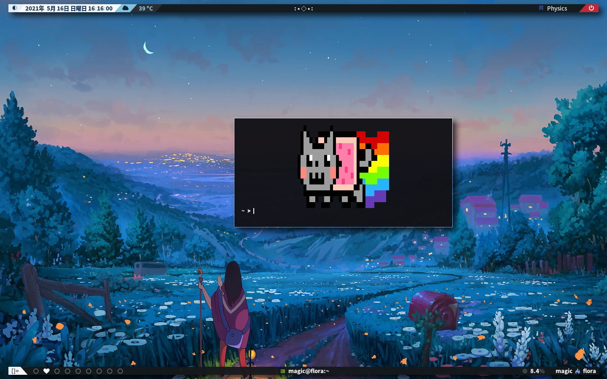

<h1 align="center">dwm - dynamic window manager</h1>



<p align="center">
  <a href="https://dwm.suckless.org/">
    
  </a>
</p>

<p align="center">tiling window manager utility for X.</p>

+ Super + Shift + X : kill unselected windows;
+ Super + N : select most recent window;
+ Super + Tab : select most recent tag;
+ Super + J : select next window;
+ Super + K : select previous window;
+ Super + Arrows : move floating window;
+ Super + Shift + Arrows : resize floating window;

## Patches

+ restartsig
+ pertag
+ movemouse window
+ vanitygaps

## FAQ

Bindings are well documented on the source code.

There is no inbuilt bar for this, you have to run an external one. I'm using [mine with those scripts](github.com/beyondMagic/scripts) (lemonbar)

## Installation for newbs

```
git clone https://github.com/BeyondMagic/dwm.git
cd dwm
make
```
